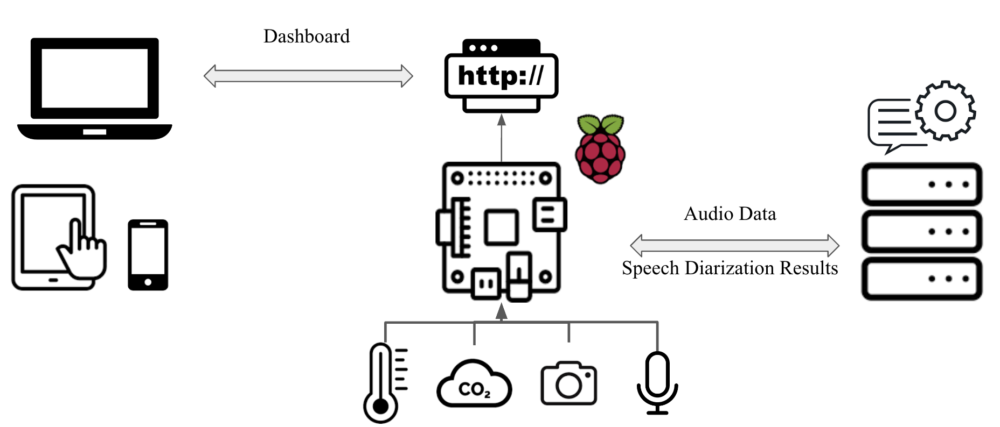

# Class profiling with multi-modal sensors

Effective and helpful methods for better understanding teaching in science, technology, engineering, and mathematics (
STEM) are of special interest in the field of pedagogy research. Many works have proposed using carefully crafted
inventory questionnaires for characterizing class performance and behaviors, such as the Teaching Practices
Inventory and the Postsecondary Instructional Practices Survey. However, most existing methods require trained
personnel to get familiar with the questionnaire and further manual profiling, which is error-prone, subjective to the
observer, and time-consuming. This inspires us to explore an automated way of profiling or characterizing class
activities to assist teachers and researchers in the field for a large-scale and objective assessment.

This project aims to use multi-modal sensors to profile class lectures and generate meaningful reports for instructors
or interested
supervisors. Specifically, in this project, we adopted temperature, air quality, visual, and acoustic information to
profile the progress of a class. This repo stores codes that implement this project.

We use a dual client-server architecture as shown below. For local testing, please make sure all user devices, the
Raspberry Pi, and the remote machine learning server are connected in the same LAN.



## Installation

### On Raspberry Pi:

1. After cloning this repo, please enter the folder and run:

```shell
pip install -r requirements.txt
```

to install dependencies needed for running the Flask server, reading the temperature sensor and air quality sensor, and
forwarding captured audio to the remote machine learning server.

2. Also, since YOLOv5 is used to process captured image, you also need to install the YOLOv5 repo by the following
   commands:

```shell
git clone https://github.com/ultralytics/yolov5.git
cd yolov5
pip install -r requirements.txt  # install
```

3. Please copy and paste the `head_count.py` file in the `sensors` folder into the YOLOv5 folder. Or, run the following
   command:

```shell
cp ../sensors/head_count.py ./head_count.py
```

### On the remote machine learning server

After cloning this repo, please enter the folder and run:

```shell
chmod +x requirements_nemo.sh
./requirements_nemo.sh
```

This creates a conda virtual environment called `nemo`. If you have not installed conda, please do so or check the
script to use pip install the requirements. Then, run:

```shell
conda activate nemo
```

to activate the environment.

## Usage

1. Please first start the remote machine learning server by running:

```shell
python speech_diarization_server.py
```

This opens port 5000 to accept the audio clip from the Raspberry Pi.

2. Please run

```shell
ifconfig
```

to get the IP address of the remote machine learning server. Then, change Line 25 in `main.py` from:

```python
REMOTE_SERVER_ENDPOINT = 'http://192.168.182.46:5000/process_audio'
```

to

```python
REMOTE_SERVER_ENDPOINT = 'http://<IP OF YOUR REMOTE ML SERVER>:5000/process_audio'
```

3. On the Raspberry Pi, run:

```shell
python main.py
```

which listens on port 12300 for client connections.

4. Please run

```shell
ifconfig
```

to get the IP address of the Raspberry Pi.

5. On your client device, open the browser and enter `http://<IP OF RASPBERRY PI>:12300` to access the dashboard.